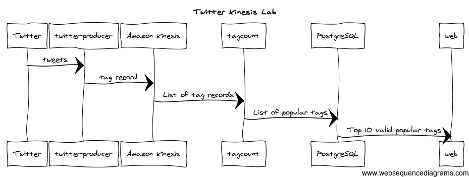

# Twitter Kinesis Lab

This system provides a kind of Twitter Trends application, implemented in Clojure. The purpose is to make it into a lab, where the user implements some parts of it in order to learn about things like Amazon Kinesis, Twitter Streaming API, Clojure, tag clouds, upsert using PostgreSQL 9.1+, and so on. However, at this point, it's a complete system with no lab steps or instructions.

## System Architecture
The system architecture can be seen in this picture:

<!--
title Twitter Kinesis Lab

Twitter->twitter-producer: tweets
twitter-producer->Amazon Kinesis: tag record
Amazon Kinesis->tagcount: List of tag records
tagcount->PostgreSQL: List of popular tags
PostgreSQL->web: Top 10 valid popular tags
-->

There are three main parts that have been implemented:

* twitter-producer
* tagcount
* web

### twitter-producer
The `twitter-producer` application is the part that gets the stream of tweets from Twitter. It uses the [Twitter Streaming API](https://dev.twitter.com/streaming/overview), and in particular the [Sample Stream](https://dev.twitter.com/streaming/reference/get/statuses/sample), where the application receives a small random sample stream, providing up to 1% of the Twitter firehose. The application provides a callback to the Streaming API, which will call the callback when there are tweets available. The callback receives parsed tweets, so it's easy to just grab the `hashtags` and the `created_at` timestamp from each tweet, and post each tag to an Amazon Kinesis stream. The `twitter-producer` application will create the stream if it's not already there, but it won't delete it, so remember to manually delete the stream when you're done with it.

The library [twitter-api](https://github.com/adamwynne/twitter-api) abstracts the asynchronous callback handling needed in the Twitter Streaming API. However, the specifications for the Twitter Streaming API are somewhat complicated, with various rules for reconnection backoff, rate limiting, keep-alive signals, chunked tweets, and so on. Therefore, we use the [twitter-streaming-client](https://github.com/mccraigmccraig/twitter-streaming-client) library to do the heavy lifting.

The library [amazonica](https://github.com/mcohen01/amazonica) handles the details needed to post a record to a Kinesis stream, as well as listing, describing and creating streams. One Kinesis shard can handle 1000 writes/s, which is a lot. By contrast, one shard can provide 5 reads/s. Will that be enough for the reader, `tagcount`, to keep up with the stream? It's your job to find out if more shards and workers are needed.

Note that `twitter-producer` shards on the hashtag, meaning that if several shards are being used, only one of the shards will receive a record with a given hashtag.

### tagcount
The `tagcount` application reads records from Amazon Kinesis. To be more precise, it provides a callback that the Amazon Kinesis client library calls with a list of records. The application holds a state containing all tags mapped to the timestamps when they occured. For each incoming tag record, the application filters only the timestamps inside a sliding window, counts them, and stores the current count and the lastest timestamp in a PostgreSQL database running in Amazon RDS. The `amazonica` library is used here to start a worker that receives records from Kinesis. The library `tools.jdbc` is used for communicating with the database.

### web
The `web` application provides the user interface. It regularly selects from the PostgreSQL database the `n` tags with the highest count, and renders an animated tag cloud in the browser. The library `tools.jdbc` is used for communicating with the database. JQuery and Underscore.js are used in the web client.

## Credentials
Common to all three applications is the use of the `environ` library to read various authentication information from the proper places. It's necessary to provide these credentials in order for the system to work. See Preparations below, and the `README.md` for each sub-system for details.

## Preparations
In order to run this system, there are a few things that need to be in place:

* The AWS account owner must subscribe to Amazon Kinesis, in the eu-west-1 region.
* Create an IaM user, say `twitter-kinesis`, with an access key but no password, giving it the following policies:
	* full Kinesis access
	* full DynamoDB access (the Kinesis client library needs this)
	* full CloudWatch access (the Kinesis client library needs this)
* Add the IaM access key credentials to your local `profiles.clj` file, according to instructions in each `README.md` in `twitter-producer`, `tagcount`, and `web`.
* Create a [Twitter application](https://dev.twitter.com/apps) and generate OAuth tokens; add those to the `profiles.clj` file in `twitter-producer`
* Create a PostgreSQL RDS instance in eu-west-1 region (same as Kinesis); use size 5GB and type t1.micro (t2.micro requires a VPC, so it could be somewhat more involved to set up if you don't have a default VPC)
* Open the RDS security group for the IPs/security groups for the `tagcount` and `web` applications, if you're running them in the cloud.
* Open the RDS security group for your own IP, if you want to access it via `psql`, or if you're running `tagcount` and `web` locally.
* Run the `migration.clj` file in `tagcount` to initialize the database; `lein run -m tagcount.migration`

## Running

Start the modules in order, ie first `twitter-producer`, then, when the stream is in state `ACTIVE`, start `tagcount`, and finally `web`. Use `lein trampoline run` for the first two, and `lein ring server` for the latter.

## Caveats

As of today, 2014-09-13, amazonica doesn't support passing a region name to the Kinesis worker, indicating where to create DynamoDB tables. This means the tables will be created in `us-east-1` for now. However, the underlying Kinesis client library supports region as of version 1.1.0. The code in `tagcount` has been prepared, so when amazonica gets patched, everything should work automatically and the table should be created in eu-west-1, as the other resources.

## License

Copyright © 2013-2014 Ulrik Sandberg, Jan Kronquist, Oskar Wickström

Distributed under the Eclipse Public License, the same as Clojure.
